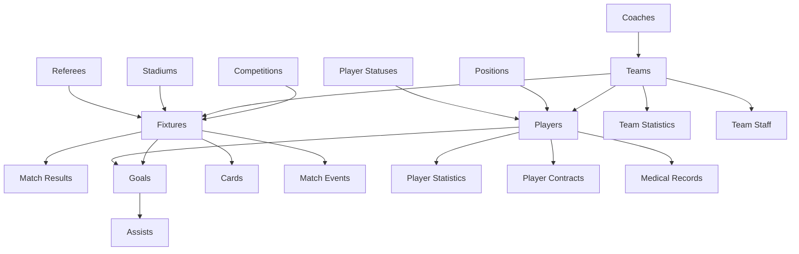

<div align="center">
  
</div>

<div align="center">
  
</div>

<p align="center">
  
  
  
  
</p>

---

## 🌟 Overview

The **Football Fixtures Database** is a comprehensive MySQL database system designed to handle all aspects of football league management. From player contracts and medical records to match statistics and team performance analytics, this database provides a complete foundation for football-related applications.

<div align="center">

| Feature | Description | Status |
|---------|-------------|--------|
| **Database Tables** | 17+ Interconnected Tables | ✅ Complete |
| **Data Views** | 4 Pre-built Views | ✅ Complete |
| **Automation** | Stored Procedures | ✅ Complete |
| **Performance** | Advanced Indexing | ✅ Optimized |
| **Multi-League** | Competition Support | ✅ Ready |
| **Real-time** | Live Statistics | ✅ Active |
| **Medical** | Injury Management | ✅ Comprehensive |
| **Contracts** | Player Management | ✅ Full Lifecycle |

</div>

---

## 🚀 Quick Start

<details>
<summary><b>📋 Prerequisites</b></summary>

- MySQL 8.0 or higher
- Database administration tool (MySQL Workbench, phpMyAdmin, etc.)
- Sufficient storage space (recommended: 1GB+ for production data)

</details>

<details>
<summary><b>⚡ Installation Steps</b></summary>

**1. Clone the repository**
```bash
git clone https://github.com/yourusername/football-fixtures-database.git
cd football-fixtures-database
```

**2. Create the database schema**
```bash
mysql -u your_username -p < Football_Fixtures_Database_Creation_Script.sql
```

**3. Populate with sample data**
```bash
mysql -u your_username -p < football-fixtures-db-population-script.sql
```

**4. Verify installation**
```sql
USE football_fixtures_db;
SHOW TABLES;
SELECT COUNT(*) FROM fixtures;
```

</details>

---

## 🏗️ Database Architecture

<div align="center">



</div>

### Core Tables Structure

<details>
<summary><b>🏆 Competition Management</b></summary>

| Table | Purpose | Key Fields |
|-------|---------|------------|
| **competitions** | League/tournament data | name, sponsor, season, country |
| **team_statistics** | Season performance | wins, draws, losses, points, goal_difference |

</details>

<details>
<summary><b>🏟️ Infrastructure</b></summary>

| Table | Purpose | Key Fields |
|-------|---------|------------|
| **stadiums** | Venue information | name, location, capacity, surface_type |
| **referees** | Match officials | name, nationality, fifa_badge |

</details>

<details>
<summary><b>👥 Personnel Management</b></summary>

| Table | Purpose | Key Fields |
|-------|---------|------------|
| **teams** | Club information | name, founded_year, colors, home_stadium |
| **coaches** | Coaching staff | name, nationality, license_level |
| **players** | Player profiles | name, position, nationality, squad_number |
| **team_staff** | Support personnel | role, department, salary |

</details>

<details>
<summary><b>⚽ Match Management</b></summary>

| Table | Purpose | Key Fields |
|-------|---------|------------|
| **fixtures** | Match scheduling | date, teams, competition, status |
| **match_results** | Final scores | home_goals, away_goals, winner |
| **goals** | Goal tracking | player, minute, goal_type, body_part |
| **assists** | Assist tracking | goal_id, player, assist_type |
| **cards** | Disciplinary actions | player, card_type, minute, reason |
| **match_events** | Match incidents | event_type, minute, description |

</details>

<details>
<summary><b>📊 Analytics & Performance</b></summary>

| Table | Purpose | Key Fields |
|-------|---------|------------|
| **player_statistics** | Season stats | goals, assists, matches_played, pass_accuracy |
| **player_fixture_stats** | Match performance | minutes, rating, shots, passes |

</details>

<details>
<summary><b>💼 Business Management</b></summary>

| Table | Purpose | Key Fields |
|-------|---------|------------|
| **player_contracts** | Contract details | start_date, end_date, salary, contract_type |
| **medical_records** | Injury tracking | injury_type, severity, return_date |

</details>

### 🔗 Relationship Highlights

<div align="center">

| Feature | Implementation | Benefit |
|---------|---------------|---------|
| **Foreign Key Constraints** | Ensure data integrity | Prevents orphaned records |
| **Cascading Updates** | Maintain consistency | Automatic relationship updates |
| **Optimized Indexes** | Fast query performance | Sub-second response times |
| **ENUM Types** | Standardized values | Data validation & consistency |

</div>

---

## 📊 Database Views

<div align="center">

### Pre-built Views for Common Queries

</div>

<table align="center">
<tr>
<td>

**🏆 League Table**
```sql
SELECT * FROM league_table 
WHERE competition_id = 1 
ORDER BY position;
```

</td>
<td>

**⚽ Top Scorers**
```sql
SELECT * FROM top_scorers 
ORDER BY goals_scored DESC 
LIMIT 10;
```

</td>
</tr>
<tr>
<td>

**📅 Upcoming Fixtures**
```sql
SELECT * FROM upcoming_fixtures 
WHERE match_date BETWEEN 
CURDATE() AND DATE_ADD(CURDATE(), INTERVAL 7 DAY);
```

</td>
<td>

**📈 Player Performance**
```sql
SELECT * FROM player_performance 
WHERE team_name = 'Manchester United'
ORDER BY goals_scored DESC;
```

</td>
</tr>
</table>

---

## ⚙️ Stored Procedures

<div align="center">

### UpdateTeamStatistics
*Automatically updates team statistics after match completion*

</div>

```sql
CALL UpdateTeamStatistics(fixture_id);
```

**Automated Features:**
- ✅ Calculates points based on match result
- ✅ Updates goal difference
- ✅ Maintains win/draw/loss records
- ✅ Handles both home and away team statistics

---

## 💡 Usage Examples

### 🔍 Advanced Query Examples

<details>
<summary><b>Get next 5 Premier League matches</b></summary>

```sql
SELECT 
    f.match_date,
    f.kick_off_time,
    ht.team_name AS home_team,
    at.team_name AS away_team,
    s.stadium_name
FROM fixtures f
JOIN teams ht ON f.home_team_id = ht.team_id
JOIN teams at ON f.away_team_id = at.team_id
JOIN competitions c ON f.competition_id = c.competition_id
JOIN stadiums s ON f.stadium_id = s.stadium_id
WHERE c.competition_name = 'Premier League'
  AND f.match_date >= CURDATE()
  AND f.status = 'Scheduled'
ORDER BY f.match_date, f.kick_off_time
LIMIT 5;
```

</details>

<details>
<summary><b>Player goal statistics analysis</b></summary>

```sql
SELECT 
    CONCAT(p.first_name, ' ', p.last_name) AS player_name,
    t.team_name,
    COUNT(g.goal_id) AS total_goals,
    COUNT(CASE WHEN g.goal_type = 'Penalty' THEN 1 END) AS penalties,
    COUNT(CASE WHEN g.body_part = 'Head' THEN 1 END) AS headers
FROM players p
JOIN teams t ON p.team_id = t.team_id
LEFT JOIN goals g ON p.player_id = g.player_id
GROUP BY p.player_id, p.first_name, p.last_name, t.team_name
HAVING total_goals > 0
ORDER BY total_goals DESC;
```

</details>

<details>
<summary><b>Team form analysis</b></summary>

```sql
SELECT 
    t.team_name,
    ts.matches_played,
    ROUND((ts.wins / ts.matches_played) * 100, 1) AS win_percentage,
    ts.goals_for,
    ts.goals_against,
    ROUND(ts.goals_for / ts.matches_played, 2) AS goals_per_match
FROM team_statistics ts
JOIN teams t ON ts.team_id = t.team_id
WHERE ts.season = '2024-25' AND ts.competition_id = 1
ORDER BY win_percentage DESC;
```

</details>

<details>
<summary><b>Player injury history report</b></summary>

```sql
SELECT 
    CONCAT(p.first_name, ' ', p.last_name) AS player_name,
    t.team_name,
    mr.injury_type,
    mr.injury_date,
    mr.expected_return_date,
    mr.severity,
    DATEDIFF(COALESCE(mr.actual_return_date, CURDATE()), mr.injury_date) AS days_out
FROM medical_records mr
JOIN players p ON mr.player_id = p.player_id
JOIN teams t ON p.team_id = t.team_id
WHERE mr.injury_date >= DATE_SUB(CURDATE(), INTERVAL 1 YEAR)
ORDER BY mr.injury_date DESC;
```

</details>

<details>
<summary><b>Stadium utilization analysis</b></summary>

```sql
SELECT 
    s.stadium_name,
    s.capacity,
    COUNT(f.fixture_id) AS matches_hosted,
    AVG(f.attendance) AS avg_attendance,
    ROUND((AVG(f.attendance) / s.capacity) * 100, 1) AS capacity_utilization_percent
FROM stadiums s
LEFT JOIN fixtures f ON s.stadium_id = f.stadium_id
WHERE f.status = 'Finished'
GROUP BY s.stadium_id, s.stadium_name, s.capacity
ORDER BY capacity_utilization_percent DESC;
```

</details>

---

## 🎯 Technical Features

<div align="center">

<table>
<tr>
<th>🔧 Technical</th>
<th>📊 Functional</th>
<th>🔒 Security</th>
</tr>
<tr>
<td>

- **UTF8MB4 Character Set**
- **InnoDB Engine**
- **Optimized Indexes**
- **Data Validation**
- **Audit Trails**
- **Stored Procedures**
- **Database Views**

</td>
<td>

- **Multi-Competition Support**
- **Real-time Match Tracking**
- **Player Career Management**
- **Medical Record Keeping**
- **Contract Management**
- **Statistical Analysis**
- **Performance Metrics**

</td>
<td>

- **Foreign Key Constraints**
- **Input Validation**
- **Role-based Access**
- **Backup-friendly**
- **Data Integrity**
- **Transaction Safety**
- **Referential Integrity**

</td>
</tr>
</table>

</div>

---

## 📈 Sample Data Overview

<div align="center">

**The database comes pre-populated with comprehensive sample data:**

</div>

<table align="center">
<tr>
<td align="center">

**🏟️ Infrastructure**
- **15** Premier League Stadiums
- Capacity & surface details
- Geographic locations
- Venue specifications

</td>
<td align="center">

**👨‍💼 Personnel**
- **15** Professional Coaches
- **31** Professional Players
- Qualifications & profiles
- Career statistics

</td>
</tr>
<tr>
<td align="center">

**🏆 Competitions**
- **5** Major Competitions
- Premier League focus
- European tournaments
- Multi-season support

</td>
<td align="center">

**📊 Match Data**
- **18+** Match Fixtures
- Complete statistics
- Goals, assists, cards
- Match events timeline

</td>
</tr>
<tr>
<td align="center">

**💼 Business Data**
- Contract information
- Salary structures
- Transfer details
- Financial tracking

</td>
<td align="center">

**🏥 Medical Records**
- Injury tracking
- Recovery timelines
- Treatment notes
- Medical staff records

</td>
</tr>
</table>

---

## 🛠️ Customization & Extension

### Adding New Competitions

```sql
INSERT INTO competitions (competition_name, sponsor, season, country) 
VALUES ('La Liga', 'Santander', '2024-25', 'Spain');
```

### Extending Player Attributes

The flexible schema allows easy addition of new player attributes:

```sql
-- Add new columns to players table
ALTER TABLE players 
ADD COLUMN market_value DECIMAL(12,2),
ADD COLUMN social_media_handle VARCHAR(100),
ADD COLUMN agent_name VARCHAR(100);
```

### Custom Views for Specific Needs

```sql
-- Team discipline analysis
CREATE VIEW team_discipline AS
SELECT 
    t.team_name,
    COUNT(CASE WHEN c.card_type = 'Yellow' THEN 1 END) AS yellow_cards,
    COUNT(CASE WHEN c.card_type = 'Red' THEN 1 END) AS red_cards,
    ROUND(COUNT(c.card_id) / COUNT(DISTINCT f.fixture_id), 2) AS cards_per_match
FROM teams t
LEFT JOIN players p ON t.team_id = p.team_id
LEFT JOIN cards c ON p.player_id = c.player_id
LEFT JOIN fixtures f ON c.fixture_id = f.fixture_id
GROUP BY t.team_id, t.team_name;

-- Player value analysis
CREATE VIEW player_market_analysis AS
SELECT 
    CONCAT(p.first_name, ' ', p.last_name) AS player_name,
    t.team_name,
    pos.position_name,
    ps.goals_scored,
    ps.assists,
    pc.weekly_salary * 52 AS annual_salary,
    TIMESTAMPDIFF(YEAR, p.date_of_birth, CURDATE()) AS age
FROM players p
JOIN teams t ON p.team_id = t.team_id
JOIN positions pos ON p.position_id = pos.position_id
LEFT JOIN player_statistics ps ON p.player_id = ps.player_id
LEFT JOIN player_contracts pc ON p.player_id = pc.player_id AND pc.is_active = TRUE
WHERE ps.season = '2024-25';
```

### Performance Optimization Tips

```sql
-- Add custom indexes for frequently queried columns
CREATE INDEX idx_fixtures_date_status ON fixtures(match_date, status);
CREATE INDEX idx_goals_player_season ON goals(player_id, fixture_id);
CREATE INDEX idx_player_stats_season_goals ON player_statistics(season, goals_scored DESC);

-- Analyze table performance
ANALYZE TABLE fixtures, players, goals, player_statistics;

-- Check query execution plans
EXPLAIN SELECT * FROM fixtures WHERE match_date >= CURDATE();
```

---

## 🤝 Contributing

<div align="center">

**We welcome contributions! Here's how you can help:**

</div>

<table align="center">
<tr>
<td align="center">

**🐛 Report Issues**
Found a bug? Let us know!
Create detailed issue reports

</td>
<td align="center">

**💡 Suggest Features**
Have ideas for improvements?
Share your enhancement proposals

</td>
<td align="center">

**📝 Improve Documentation**
Help make our docs better
Add examples and tutorials

</td>
<td align="center">

**🔧 Submit Code**
Fork, develop, and create PRs
Follow coding standards

</td>
</tr>
</table>

### Development Workflow

```bash
# 1. Fork and clone the repository
git clone https://github.com/yourusername/football-fixtures-database.git
cd football-fixtures-database

# 2. Create a feature branch
git checkout -b feature/amazing-feature

# 3. Make your changes and test thoroughly
mysql -u root -p < your-changes.sql

# 4. Run validation tests
mysql -u root -p football_fixtures_db < tests/validation_tests.sql

# 5. Commit with clear, descriptive messages
git add .
git commit -m "feat: add player transfer tracking functionality"

# 6. Push and create pull request
git push origin feature/amazing-feature
```

### Code Standards

- **SQL Style**: Use uppercase for keywords, lowercase for identifiers
- **Naming**: Use descriptive names with consistent conventions
- **Comments**: Document complex queries and business logic
- **Testing**: Include test data and validation queries
- **Documentation**: Update README for new features

---

## 🙏 Acknowledgments

<div align="center">

**Built with ❤️ for the football community**

</div>

<table align="center">
<tr>
<td align="center">

**🛢️ MySQL Team**
For the robust database engine
and excellent documentation

</td>
<td align="center">

**⚽ Football Community**
For inspiration, requirements,
and real-world use cases

</td>
<td align="center">

**👥 Contributors**
Everyone who helped improve
this project with code and ideas

</td>
<td align="center">

**🌐 Open Source**
Standing on the shoulders of giants
in the open source ecosystem

</td>
</tr>
</table>

---

<div align="center">
  
</div>

<div align="center">

**⭐ Star this repository if you find it useful!**
</div>
